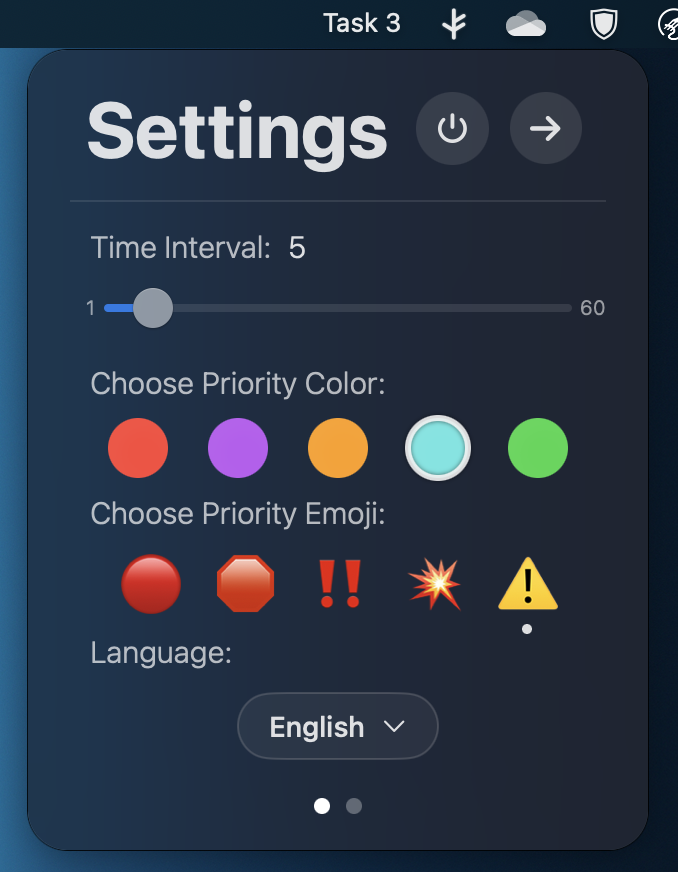
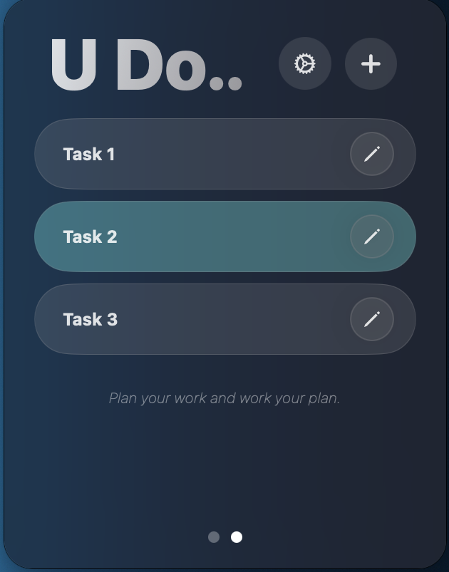

<h1 align="center">U Do</h1>

U Do is a macOS menubar app that rotates tasks from a to-do list and will show on your menubar directly.

U Do 是一款 macOS 菜单栏应用，能够从待办事项列表中轮换任务，并直接显示在菜单栏上。

## Features 功能

- **Menubar Display:** Tasks are shown directly on the macOS menubar. **菜单栏显示：** 任务直接显示在 macOS 菜单栏上。
- **Automatic Rotation:** Tasks rotate every 5 seconds (Default) for easy tracking. **自动轮换：** 任务每 5 秒（默认）轮换一次，方便跟踪。 
- **Settings:** Set your own time interval, priority color, and priority emoji. **设置：** 可以设置自己的时间间隔、优先级颜色和优先级表情符号。 
- **Task Management:** Add, delete, and set time interval between tasks. Double click on the completed task to delete it. Drag task to reorder. **任务管理：** 添加、删除任务并设置任务之间的时间间隔。双击已完成的任务即可删除。拖动任务来排序。
- **Task Priority:** Able to select normal or high priority for your task. High-priority tasks will have a emoji in front. **任务优先级：** 可以为任务选择普通或高优先级。高优先级任务会在前方加上表情符号。 
- **Optional Visible Task:** Able to choose the task that you dont want to show. 

## Requirements 要求

- macOS 13.3 and after macOS 13.3 及以上版本

## Contributing 贡献

Feel free to submit [issues](https://github.com/chriyocc/U-Do/issues) or contribute improvements via [pull requests](https://github.com/chriyocc/U-Do/pulls). 欢迎提交 [issues](https://github.com/chriyocc/U-Do/issues) 或通过 [pull requests](https://github.com/chriyocc/U-Do/pulls) 改进。

## Links 链接

[Download 下载](https://github.com/chriyocc/U-Do/releases/latest)

## Installation Guide 安装教学

1. Download from releases or [download](https://github.com/chriyocc/U-Do/releases/latest). 从发布页面[下载](https://github.com/chriyocc/U-Do/releases/latest)。
2. Drag U Do to Applications Folder. 将 U Do 拖动到“应用程序”文件夹。
3. **MUST** right click and press open. **一定要**右键选择打开。
4. Done. 完成。

## Instructions 使用指南

1. Press the + button to add a new task. 按下“+”按钮添加新任务。
2. Long press a task to set its priority. 长按任务以设置优先级。
3. Double click a task to mark it as done or delete it. 双击任务以标记为完成或删除。
4. Press the power off button to quit the U Do app. 按下电源按钮退出 U Do 应用程序。
